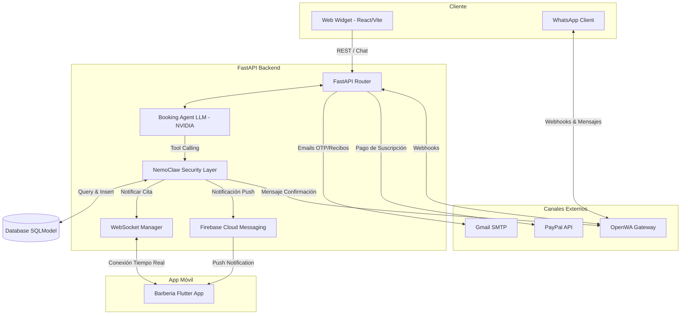

# 💈 Balam SaaS - Plataforma Inteligente de Reservas para Barberías

Balam es un ecosistema SaaS moderno y premium diseñado para la automatización, gestión y reserva inteligente de citas en barberías. Cuenta con un agente de Inteligencia Artificial integrado, notificaciones en tiempo real, notificaciones push, pasarela de pagos (PayPal) y un canal interactivo mediante WhatsApp.

---

## 🏗️ Arquitectura General del Sistema

El ecosistema de Balam está compuesto por tres componentes principales:



1. **Backend (FastAPI)**: Servidor central en Python que maneja la lógica de negocio, la base de datos (SQLModel con PostgreSQL/SQLite), autenticación JWT, servicios de correo OTP, webhook de WhatsApp y la capa de seguridad **NemoClaw** que controla las llamadas del agente de IA.
2. **App de Barberos (Flutter)**: Aplicación móvil nativa para que los barberos y administradores gestionen su agenda, reciban notificaciones push (FCM) y visualicen actualizaciones en tiempo real a través de WebSockets.
3. **Web Widget (React + Vite + TS)**: Interfaz de chat interactiva que los clientes pueden usar desde su navegador para conversar con el agente de IA y agendar citas.

---

## 🤖 Funciones de Inteligencia Artificial (NVIDIA NIM)

El corazón automatizado de Balam es su **Booking Agent**, un agente conversacional avanzado que utiliza el modelo `meta/llama-3.1-8b-instruct` a través de la infraestructura de **NVIDIA API / NIM**.

### Flujo de Agenda de Citas por IA
El agente conversacional no es un simple chat de respuesta fija; está programado mediante **Tool Calling** (llamada a funciones) con las siguientes capacidades críticas de negocio:

1. **Obtención de Servicios (`get_services`)**: El agente consulta a la base de datos los servicios activos de la barbería (ej. Corte Clásico, Corte y Barba) con sus respectivos precios y duraciones para informar al cliente de manera precisa.
2. **Consulta Dinámica de Horarios (`get_available_slots`)**:
   - El agente **nunca inventa horarios**.
   - Al recibir una fecha (ej. "mañana" o "este sábado"), el agente traduce el texto a formato `YYYY-MM-DD` e invoca la función para consultar los horarios configurados de apertura/cierre de la sucursal, restando las citas ya agendadas y bloqueadas.
   - Si la barbería está cerrada ese día o llena, informa de manera empática que no hay turnos.
3. **Creación de Citas (`create_appointment`)**:
   - **Regla Estricta**: El agente tiene estrictamente prohibido agendar si el cliente no proporciona su **Nombre** y **Número de Teléfono** real.
   - Una vez recopilada toda la información (Nombre, Teléfono, Servicio, Fecha y Hora elegida), el agente invoca la creación de la cita.

### 🛡️ Capa de Seguridad NemoClaw
Toda acción del LLM pasa por **NemoClaw Security**, que actúa como middleware para:
* Validar parámetros antes de guardarlos en la base de datos.
* Prevenir inserciones de datos falsos o corrompidos.
* Disparar eventos secundarios automatizados una vez creada la cita:
  1. **Confirmación vía WhatsApp**: Se envía automáticamente un mensaje al teléfono del cliente pidiéndole confirmar su asistencia ("Responder con Confirmar/Cancelar").
  2. **Notificación en Tiempo Real**: Envía la nueva cita instantáneamente al dashboard de la App de Flutter mediante WebSockets.
  3. **Notificación Push (FCM)**: Hace sonar el teléfono del barbero asignado con un recordatorio push directo.

---

## 📲 Ecosistema Flutter (App para Barberos)

La aplicación móvil en `barberia_flutter` está diseñada para el uso diario de los barberos de la sucursal:
* **Dashboard en Tiempo Real**: Muestra el listado de citas pendientes, confirmadas y finalizadas del día.
* **Integración WebSocket**: Escucha de forma activa el servidor FastAPI. Al momento que el cliente reserva con la IA, la cita aparece automáticamente en la app del barbero sin necesidad de recargar.
* **Notificaciones Push con Firebase**: Recibe alertas instantáneas en segundo plano de nuevas citas creadas o cancelaciones, optimizando los tiempos de preparación del equipo.
* **Geolocalización de Sucursales**: Administra la dirección física, latitud y longitud de cada sucursal para mostrarlas en mapas.

---

## 🔧 Configuración e Instalación

### Requisitos Previos
* Python 3.10+
* Flutter SDK (3.x)
* Node.js v18+ (para el Widget web y OpenWA Gateway)
* Docker y Docker Compose (opcional, para base de datos y Redis de producción)

### 1. Variables de Entorno
Copia el archivo `.env.example` como `.env` en la raíz del proyecto y llena los campos correspondientes con tus claves:
```bash
cp .env.example .env
```
Asegúrate de configurar:
* **NVIDIA_API_KEY**: Tu clave de NVIDIA para el agente conversacional.
* **DEEPSEEK_API_KEY**: Clave de API de DeepSeek para modelos de soporte alternativos.
* **GMAIL_USER** y **GMAIL_PASSWORD**: Dirección y clave de aplicación para el envío de códigos OTP y recibos en formato HTML premium.
* **PAYPAL_CLIENT_ID** y **PAYPAL_CLIENT_SECRET**: Credenciales en modo sandbox o producción para cobro de suscripciones.

### 2. Iniciar el Backend (FastAPI)
1. Crea tu entorno virtual e instala dependencias:
   ```bash
   python -m venv .venv
   .venv\Scripts\activate  # En Windows
   pip install -r requirements.txt
   ```
2. Inicializa la base de datos y corre los scripts de siembra (seeds):
   ```bash
   python create_tables.py
   python seed_db.py
   ```
3. Ejecuta el servidor de desarrollo:
   ```bash
   uvicorn api.main:app --reload --port 8000
   ```

### 3. Iniciar el Widget Web
1. Entra a la carpeta del widget:
   ```bash
   cd frontend/widget
   npm install
   npm run dev
   ```

### 4. Iniciar la App Móvil (Flutter)
1. Asegúrate de tener un emulador abierto o un dispositivo conectado.
2. Desde la carpeta `barberia_flutter`:
   ```bash
   cd barberia_flutter
   flutter pub get
   flutter run
   ```

---

## 🚀 Publicación y Despliegue

Este repositorio está preparado para ser desplegado en servicios modernos como:
* **Fly.io** (el backend incluye los archivos `fly.toml` y `Dockerfile` listos para producción).
* **Docker Compose** (puedes levantar el backend junto con PostgreSQL, Redis y OpenWA usando el comando `docker-compose up -d`).
